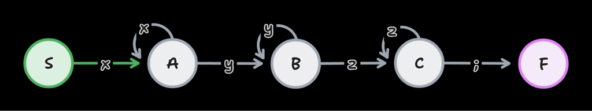
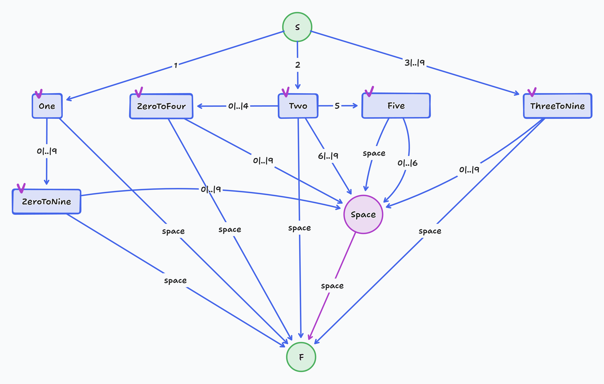
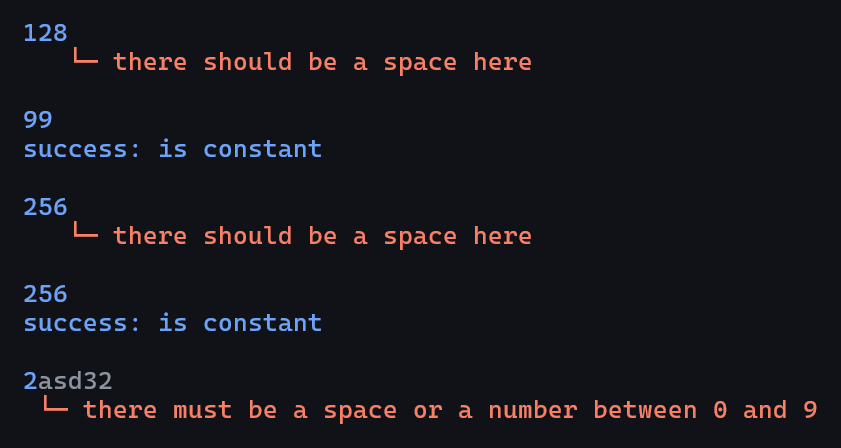

## What's that?

A syntax analyzer written in Rust as part of one of my university course subjects.

The current version knows how to define chains of the `xyz` kind with any number (greater than 0) of `x`, `y` and `z`.
That is, the chain `xyz` is the minimal possible chain.

The analyzer uses states to determine actions on the next symbol in the chain.
Here the states `S`, `F` and `E` are responsible for start, finish and error respectively.
`A`, `B` and `C` define the current symbol in the chain (`x`, `y` and `z` respectively).

In a graph, it looks as follows:

## Constant

The constants (numbers from 1 to 256) are analyzed according to the following scheme:

An example of analyzer's work for constants:

